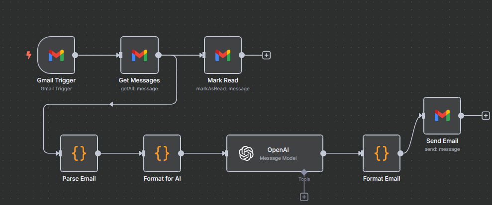
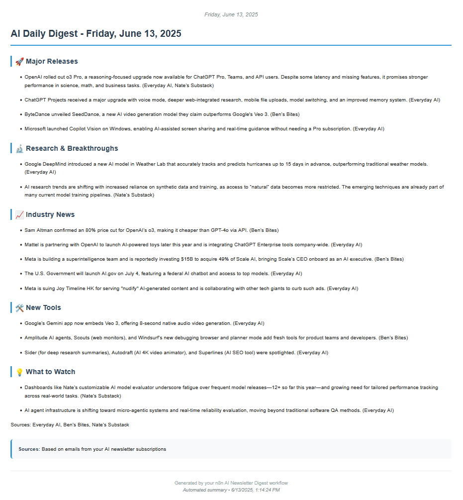

# AI Newsletter Summarizer Flow (n8n)

This n8n workflow automatically fetches, parses, summarizes, and delivers a daily digest of selected AI newsletters from your Gmail inbox using OpenAI. The result is a well-formatted, concise summary delivered to your email.

---

## Workflow Diagram



---

## Workflow Overview

**Nodes in the Flow:**

1. **Gmail Trigger**
   - Triggers daily at 9am (configurable)
   - Filters for emails with a specific label (e.g., "Newsletter")

2. **Get Messages**
   - Fetches all unread emails from selected senders (e.g., Substack newsletters, The Batch, Everyday AI, etc.)
   - Filters by label, sender, and date

3. **Mark Read**
   - Marks processed emails as read to avoid duplicate processing

4. **Parse Email** (Code Node)
   - Parses and cleans email content (text or HTML)
   - Extracts sender, subject, date, and content
   - Scores and filters emails for relevance to AI/newsletter topics

5. **Format for AI** (Code Node)
   - Sorts emails by content score
   - Formats them into a strict prompt for OpenAI, with anti-hallucination instructions
   - Groups content for summarization

6. **OpenAI**
   - Uses the GPT-4o model to generate a daily digest summary from the formatted prompt

7. **Format Email** (Code Node)
   - Converts the OpenAI markdown summary to styled HTML
   - Prepares the email subject and body for delivery

8. **Send Email**
   - Sends the final digest to your chosen email address

---

## Example Newsletters Processed
- dwarkesh+blog@substack.com
- bensbites@substack.com
- natesnewsletter@substack.com
- info@youreverydayai.com
- thebatch@deeplearning.ai

You can customize the sender list in the **Get Messages** node.

---

## Setup Instructions

1. **Import the Workflow**
   - Download `newsletter-summarizer-flow-n8n.json` from this repo.
   - In n8n, go to Workflows > Import from File and select the JSON.

2. **Configure Credentials**
   - Set up Gmail OAuth2 credentials in n8n (for reading and sending emails).
   - Set up OpenAI API credentials for the OpenAI node.

3. **Customize Filters**
   - In the **Get Messages** node, adjust the `sender` filter and `labelIds` to match your newsletter sources and Gmail labels.
   - Adjust the `receivedAfter` date if needed.

4. **Set Delivery Email**
   - In the **Send Email** node, set the `sendTo` parameter to your preferred recipient address.

5. **(Optional) Adjust Schedule**
   - In the **Gmail Trigger** node, change the `pollTimes` to your preferred time.

6. **Activate the Workflow**
   - Enable the workflow in n8n to start daily summaries.

---

## Output Example

The digest email will be structured as:

```
# AI Daily Digest - [Date]

## 🚀 Major Releases
- ...

## 🔬 Research & Breakthroughs
- ...

## 📈 Industry News
- ...

## 🛠️ New Tools
- ...

## 💡 What to Watch
- ...

Sources: [newsletter names]
```

The email is sent in both HTML and plain text, with modern styling for readability.

### Sample Output Email



---

## Customization
- **Newsletter Sources:** Edit the `sender` filter in **Get Messages** to add/remove newsletters.
- **Digest Format:** Edit the prompt in **Format for AI** node to change summary structure or instructions.
- **Delivery:** Change the recipient in **Send Email** or add more delivery nodes (Slack, Notion, etc.).
- **Schedule:** Adjust the trigger time in **Gmail Trigger**.

---

## Requirements
- n8n (self-hosted or cloud)
- Gmail account with OAuth2 credentials
- OpenAI API key

---

## License
MIT License
